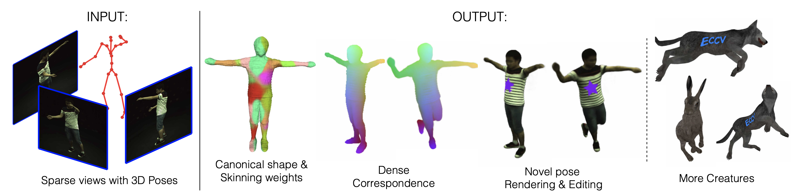
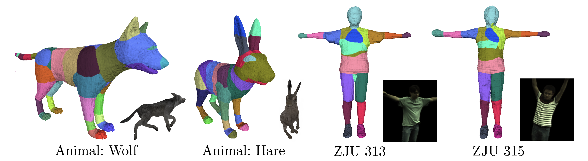

# TAVA

Code for the paper "TAVA: Template-free Animatable Volumetric Actors"

<div>

<p> Left: TAVA creates a virtual actor from multiple sparse video views as well as 3D poses. The same skeleton can later be used for animation. Center: TAVA uses this information to create a canonical shape and a pose-dependent skinning function and establishes correspondences across poses. The resulting model can be used for rendering and posing the virtual character as well as editing it. Right: the method can directly used for other creatures as long as a 3D skeleton can be defined.
</p>
</div>

## Installation
```
conda create -n tava python=3.9
conda activate tava

conda install pytorch cudatoolkit=11.3 -c pytorch
pip install protobuf imageio[freeimage]

python setup.py develop
```

## Running the code 

- See [EXPERIMENT.md](docs/EXPERIMENT.md) for instructions on training.
- See [MODEL_ZOO.md](docs/MODEL_ZOO.md) for pretrained checkpoints and replication of our paper.

## Toolbox
- [tools/extract_mesh_weights.ipynb](tools/extract_mesh_weights.ipynb): Extracting mesh and skinning weights from the learnt canonical space.


- [tools/eval_corr.ipynb](tools/eval_corr.ipynb): Evaluate the pixel-to-pixel correspondences using ground-truth mesh on Animal Data.

## License

BSD 3-clause (see LICENSE.txt).

## Misc

- Training [Mip-NeRF](https://jonbarron.info/mipnerf/) on NeRF synthetic dataset: See [here](docs/mipnerf.md) for instructions.
