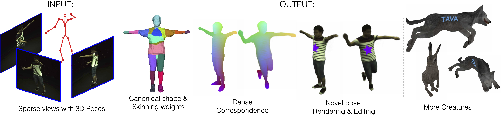
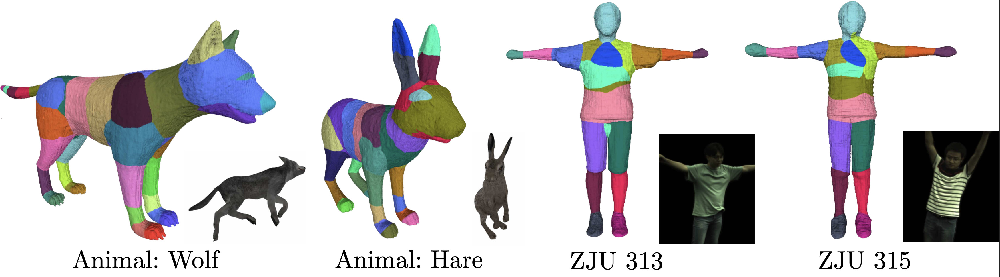
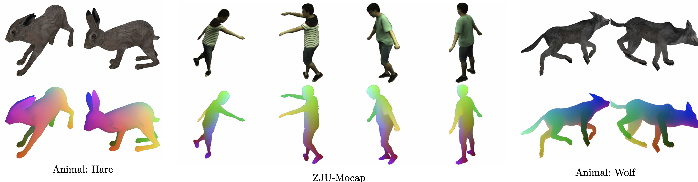

<p align="center">

  <h1 align="center">TAVA: Template-free Animatable Volumetric Actors</h1>
  
  <p align="center" style="font-size:16px">
    <a href="https://www.liruilong.cn/"><strong>Ruilong Li</strong></a>
    ·
    <a href="https://scholar.google.com/citations?user=eVHCoTsAAAAJ&hl=en"><strong>Julian Tanke</strong></a>
    ·
    <a href="https://minhpvo.github.io/"><strong>Minh Vo</strong></a>
    ·
    <a href="https://zollhoefer.com/"><strong>Michael Zollhoefer</strong></a>
    <br>
    <a href="https://pages.iai.uni-bonn.de/gall_juergen/"><strong>Jürgen Gall</strong></a>
    ·
    <a href="https://people.eecs.berkeley.edu/~kanazawa/"><strong>Angjoo Kanazawa</strong></a>
    ·
    <a href="https://christophlassner.de/"><strong>Christoph Lassner</strong></a>
  </p>
  <p align="center" style="font-size:16px">ECCV 2022</p>

  <p align="center">
  <br>
    <a href='https://arxiv.org/pdf/2206.08929.pdf'></a>
    <a href='https://www.liruilong.cn/projects/tava/' style='padding-left: 0.5rem;'></a>
  </p>
  <div align="center">
  </div>

  
  <br/>
  <p>Given multiple sparse video views as well as 3D poses as inputs, TAVA creates a virtual actor consists of implicit shape, apperance, skinning weights in the canonical space, which is ready to be animated and rendered even with out-of-distribution poses. Dense correspondences across views and poses can also be established, which enables content editing during rendering. Without requiring body template, TAVA can be directly used for creatures beyond human as along as the skeleton can be defined.</p>
</p>

---

## Installation
```
conda create -n tava python=3.9
conda activate tava

conda install pytorch cudatoolkit=11.3 -c pytorch

python setup.py develop
```

## Running the code 
- See [docs/dataset.md](docs/dataset.md) on how to accquire data used in this paper.
- See [docs/experiment.md](docs/experiment.md) on using this code base for training and evaluation.
- See [docs/benchmark.md](docs/benchmark.md) for replication of our paper.

## Toolbox
- [tools/extract_mesh_weights.ipynb](tools/extract_mesh_weights.ipynb): Extracting mesh and skinning weights from the learnt canonical space.
<div align="center"></div>

- [tools/eval_corr.ipynb](tools/eval_corr.ipynb): Evaluate the pixel-to-pixel correspondences using ground-truth mesh on Animal Data.
<div align="center"></div>

## License

BSD 3-clause (see LICENSE.txt).

## Misc

- Training [NeRF](https://www.matthewtancik.com/nerf) on NeRF synthetic dataset: See [docs/nerf.md](docs/nerf.md) for instructions.
- Training [Mip-NeRF](https://jonbarron.info/mipnerf/) on NeRF synthetic dataset: See [docs/mipnerf.md](docs/mipnerf.md) for instructions.


## Citation

```bibtex
@article{li2022tava,
  title     = {TAVA: Template-free Animatable Volumetric Actors},
  author    = {Ruilong Li, Julian Tanke, Minh Vo, Michael Zollhoefer, Jürgen Gall, Angjoo Kanazawa and Christoph Lassner},
  journal   = {European Conference on Computer Vision},
  year      = {2022},
}
```
